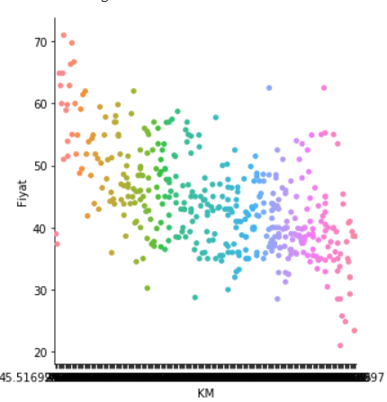
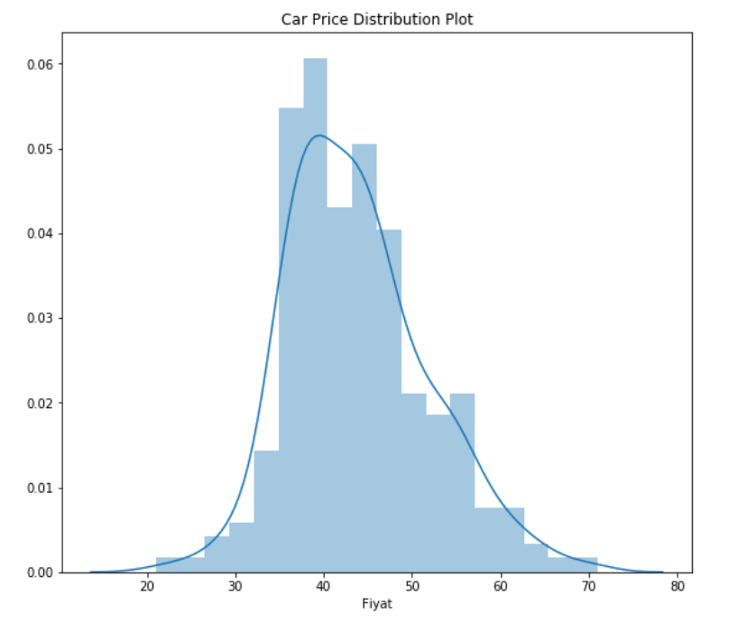

# DataScience_Car_Feautures
a repo to examine peugeot 206 features

## WEB Scraping

I scraped six features Peugeot 206 for sale:
* Model
* KM
* Renk
* Yıl
* Şehir
* Fiyat

The dataset has 428 rows and 6 columns.

## Data Cleaning

After scraping the data I cleaned it up.

 * Parsed spaces out of features.
 * Imputed missing values

## EDA

I looked at the distributions of the data and examined relationship between car's price and features.

### Inference
* Model 1.4 XR seemed to be favored Peugeot 206 model.
* White color is prefered so much.
* The most cars for sales in İstanbul.

* When KM increases then Fiyat is decreases.
* Yellow cars is more expensive.
* The cars more expensive in Hatay.
* 1.4 Fever models are more expensive.

* 1.4 Feline and 1.4 Fever models have highest avarage prices.
* Bolu has highest avarage prices.
* Yellow cars have highest avarage prices.

## Model Building

 Firstly I transformed the categorical variables into dummy variables. Then I split the dataset into train and test with a test size %20.

I triead four models :

* Linear Regression
* SVR
* Decision Tree
* Random Forest
